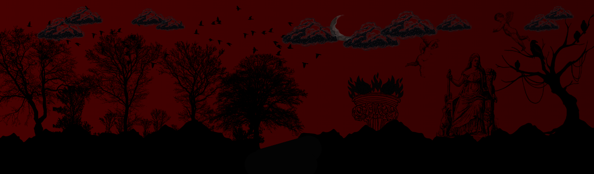

  Desenvolvedora FullStack em evolução

###  Tecnologias

  

###  Projetos em Destaque

<table align="center">
<tr>
<td width="420">

<h3 align="center"> Meu Portfólio</h3>

Portfólio pessoal.

<a href="https://github.com/maria0fernanda0/PortifolioPessoal">
🔗 Ver repositório
</a>

</td>
</tr>
</table>

 

<table align="center">
<tr>
<td width="420">

<h3 align="center">ExcelencIA</h3>

Plataforma de simulação de entrevistas de emprego com auxílio de IA.

<a href="https://github.com/maria0fernanda0/Projeto-Excelencia-Start-Tech">
🔗 Ver repositório
</a>

</td>
</tr>
</table>

